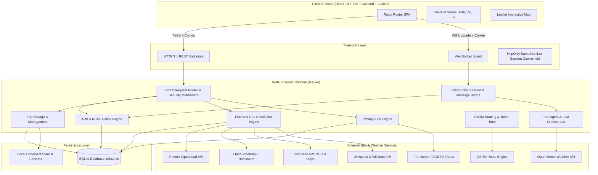
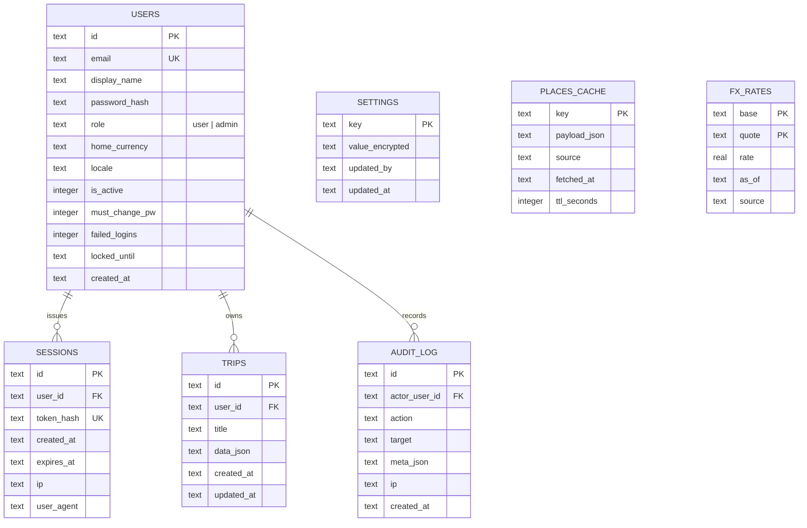
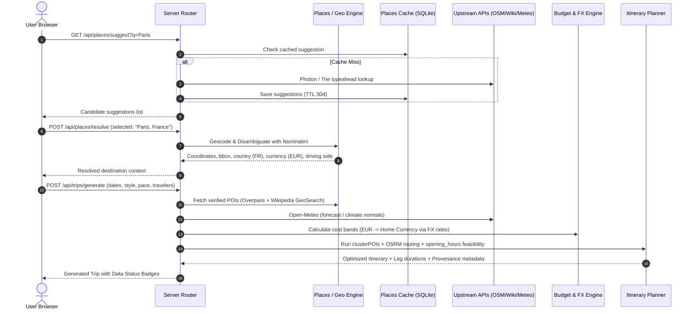
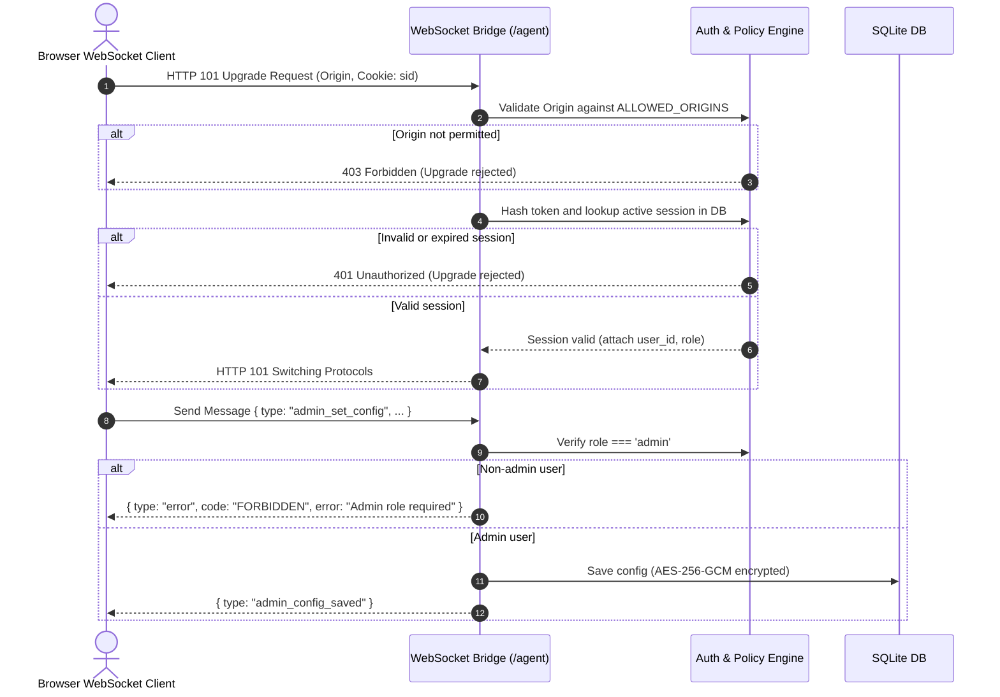

# Architecture & System Design — MyAI-SmarttripPlanner

## 1. System Overview

**MyAI-SmarttripPlanner** is a self-hosted, local-first intelligent travel planner engineered with a modern full-stack web architecture. It combines a React single-page application with a high-performance Node.js service, backed by a persistent relational SQLite engine (`node:sqlite`) and verified external geo-data providers.

---

## 2. Target Architecture



---

## 3. Entity-Relationship (ER) Schema

The persistence layer uses a normalized SQLite database with foreign key enforcement and indexed lookups.



---

## 4. End-to-End Data Flow: "Place Search to Itinerary"

This sequence illustrates how user input converts into a verified, geographically routed, and budgeted day-by-day plan without fake data.



---

## 5. Security & Authentication Flow

### 5.1 HTTP Session Authentication & Rotation
```mermaid
sequenceDiagram
    autonumber
    actor Client as User / Admin Client
    participant Auth as Auth Handler (/api/auth)
    participant DB as SQLite (users, sessions, audit_log)

    Client->>Auth: POST /api/auth/login { email, password }
    Auth->>DB: Query user by email
    alt User locked out (failed_logins >= 5 and locked_until > now)
        Auth-->>Client: 429 "Too many failed attempts. Account locked."
    else Invalid credentials
        Auth->>DB: Increment failed_logins (set locked_until if >= 5)
        Auth-->>Client: 401 "Invalid email or password" (generic)
    else Valid credentials
        Auth->>Auth: crypto.scrypt verify (constant-time timingSafeEqual)
        Auth->>DB: Reset failed_logins = 0
        Auth->>Auth: Generate 256-bit cryptographically secure token
        Auth->>DB: Store SHA-256(token) with expiry & IP
        Auth->>DB: Insert AUDIT_LOG entry (login)
        Auth-->>Client: 200 OK + Set-Cookie: sid=<token>; HttpOnly; SameSite=Lax
    end
```

### 5.2 WebSocket Upgrade & RBAC Verification


---

## 6. Provenance & Honest Data Architecture

Every data point rendered in the UI adheres to the **Provenance Contract**:

```typescript
interface ProvenanceRecord {
  source: 'osm' | 'wikipedia' | 'wikidata' | 'nominatim' | 'photon' | 'osrm' | 'open-meteo' | 'cost-table' | 'user' | 'bundled';
  fetchedAt: string; // ISO 8601 UTC timestamp
  confidence: 'verified' | 'estimate' | 'sample';
  sourceUrl?: string;
}
```

- **Live Data**: Queried from authoritative public APIs, cached in `places_cache` with strictly governed TTLs.
- **Cost Estimates**: Extracted from empirical country/city tables (`data/costTable.json`) with primary destination currency, mapped to user home currency via cached ECB exchange rates.
- **Sample/Demo Mode**: Activated only when explicit demo build or offline flag is configured; prominently tagged with UI indicators.
